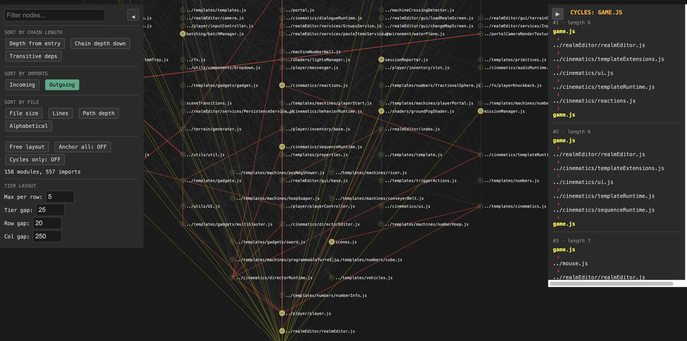

# dependency_graph
This was built for a javascript ES/6 module project.
Claude helped me build this to show where my dependency cycles were.

Usage: python3 viz.py path/to/your/entry/file.js

file.js is the file that starts your dependency import chain.

Output: viz.html which looks like this:

